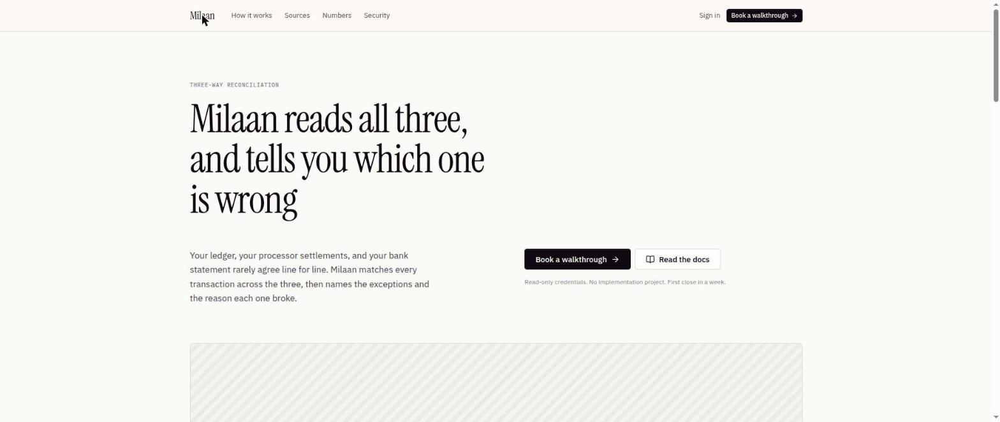

# Milaan

*Milaan* is Hindi and Urdu for **meeting** — the point where separate records finally come together.

A landing page and design system for a three-way reconciliation product: something that reads your ledger, your payment processor's settlement report, and your bank statement, matches every transaction across all three, and tells you exactly which one is wrong and why — instead of just flagging that two numbers disagree.



## Why three-way, not two-way

A two-way match (ledger vs. bank, say) can tell you a number differs. It can't tell you *which side to trust*. Bring in the third record — the processor settlement sitting between the two — and the answer is usually obvious and always defensible: you can see which pair agrees and which one is the outlier.

## What's in this repo

This isn't a working reconciliation engine — it's the front door: a marketing site plus the full visual language behind it, built as a self-contained set of React components with **no build step**. Open `index.html` in a browser and it runs, JSX compiled on the fly.

```
milaan/
├── index.html              entry point — loads fonts, React, and the two scripts below
├── styles/
│   └── tokens.css          the full design-token system: color, type, spacing, motion
├── src/
│   ├── design-system.jsx   the component kit — Button, Card, Badge, LedgerTable,
│   │                       ThreeWayCompare, VarianceBar, icons, and more
│   └── site.jsx            the landing page itself, composed from the kit above
└── docs/
    └── screenshot.jpg
```

## The design system

**Color.** One neutral ink ramp (plum-cast near-black warming to paper) plus four signal hues — match, review, break, info — that deliberately share the same lightness and chroma in [OKLCH](https://oklch.com/) space, so no status color ever visually outshouts another. All defined as CSS custom properties in `styles/tokens.css`.

**Type.** Three typefaces, each with exactly one job:
- **Instrument Serif** — display only: headlines, big marketing numbers.
- **IBM Plex Sans** — everything else in the interface.
- **IBM Plex Mono** — every figure, id, timestamp, and table column, with tabular lining numerals and a slashed zero, because anything a reader might compare down a column belongs in mono.

**Everything else.** A 4px spacing scale, restrained radii (this is a ledger, not a pill-shaped consumer app), and near-absent shadows — depth comes from hairline rules, not elevation.

## Running it locally

No install, no build:

```bash
python3 -m http.server 8000
# then open http://localhost:8000
```

Or just double-click `index.html`.

## Stack

- [React 18](https://react.dev/) + [Babel Standalone](https://babeljs.io/docs/babel-standalone) — JSX compiled in-browser, no bundler
- Plain CSS custom properties for the design tokens — no CSS-in-JS, no framework
- Fonts served from Google Fonts

## License

MIT — see [LICENSE](LICENSE).
